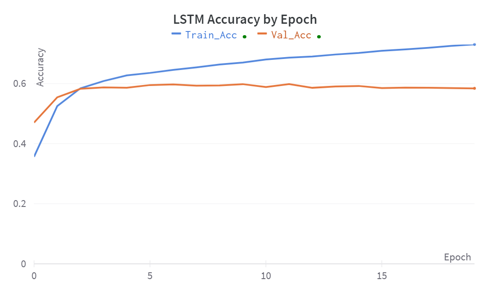
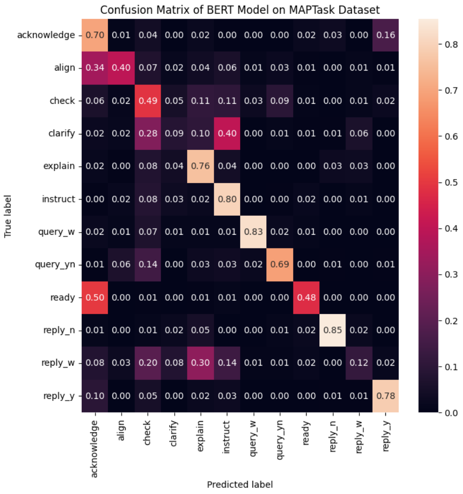
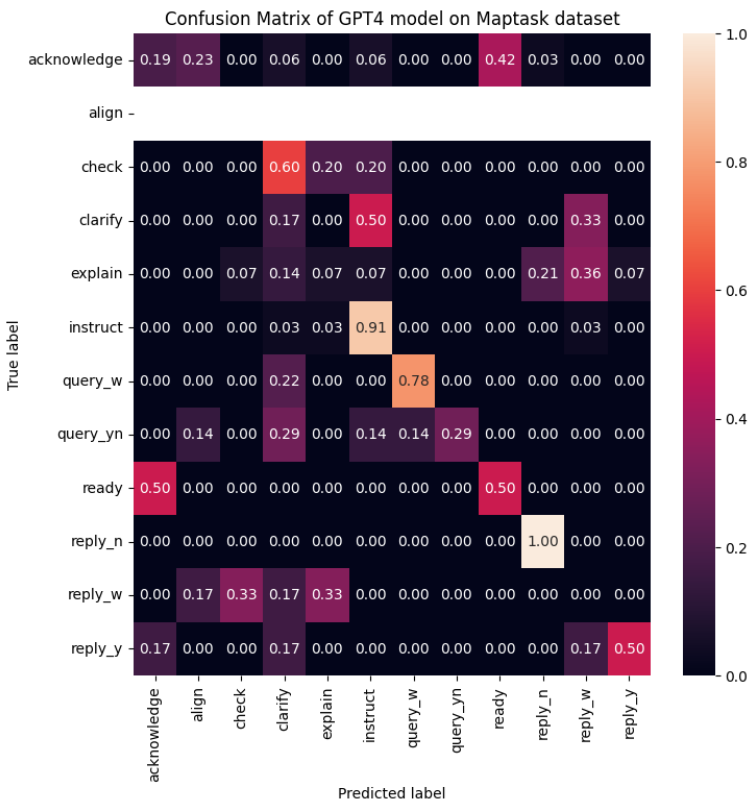

# Intent Classification

A benchmark of different approaches on the task of Intent Classification on the [Hugging Face Silicone Maptask dataset](https://huggingface.co/datasets/silicone/viewer/maptask/train):

| **Approach**          | **Model**        | **Performance (Test Accuracy)** | Pros                                | Cons                      |
| --------------------- | ---------------- | ------------------------------- | ----------------------------------- | ------------------------- |
| Human                 | Manual Labelling | 54.1%                           | Generally correct                   | Takes time                |
| Training from Scratch | LSTM             | 61.0%                           | Low resource cost                   | Not the best model        |
| Fine-Tuning           | BERT             | 63.4%                           | Best model                          | High resource cost        |
| Prompting             | GPT-4            | 43.3%                           | Automated with no training required | Expensive, Low perfomance |

## Table of Contents

- [**Dataset**](#dataset)
- [**Human Level Performance**](#human-level-performance)
- [**Training from Scratch (LSTM)**](#training-from-scratch-lstm)
- [**Fine-Tuning (BERT)**](#fine-tuning-bert)
- [**Prompting (GPT-4)**](#prompting-gpt-4)


## Dataset

The dataset has 12 labels:

| **Label**   | **Example**                                            |
| ----------- | ------------------------------------------------------ |
| acknowledge | uh-huh                                                 |
| align       | okay                                                   |
| check       | on the right-hand side roughly just                    |
| clarify     | right beside it                                        |
| explain     | i've got a gallows to the left like d-- below the left |
| instruct    | okay the start part is at the top left-hand corner     |
| query_w     | how far underneath the diamond mine                    |
| query_yn    | do you have a diamond mine there                       |
| ready       | well                                                   |
| reply_n     | no                                                     |
| reply_w     | no i haven't got that                                  |
| reply_y     | uh-huh                                                 |

The label distribution is not too imbalanced which means that accuracy is still a useful metric to use. We will also use confusion matrixes to make sure that some labels are not forgotten by our models.

<p align="center">
  
</p>

## Human Level Performance

**The human accuracy is at 54.1% (13/24 examples correct)**

Measuring this metric was done by guessing 24 labels for 24 utterances by only using for reference 3 labelled examples per label.

The logs of the expermiment are available at `human_level_perf.txt`

This sets a baseline performance and highlights challenges when predicting these labels: some labels are very similar
- "right" can be ready but can also be acknowledge or reply_y which highlights intersection between labels
- clarify ("right down there") and check ("right beside it") can be confused without punctuation

## Training from Scratch (LSTM)

In this part we train a simple LSTM model on the task:

```
_________________________________________________________________
Layer (type)                 Output Shape              Param #   
=================================================================
embedding (Embedding)        (None, None, 128)         3906816   
_________________________________________________________________
bidirectional (Bidirectional (None, None, 512)         788480    
_________________________________________________________________
dropout (Dropout)            (None, None, 512)         0         
_________________________________________________________________
bidirectional_1 (Bidirection (None, 512)               1574912   
_________________________________________________________________
dropout_1 (Dropout)          (None, 512)               0         
_________________________________________________________________
dense (Dense)                (None, 256)               131328    
_________________________________________________________________
dropout_2 (Dropout)          (None, 256)               0         
_________________________________________________________________
dense_1 (Dense)              (None, 12)                3084      
=================================================================
Total params: 6,404,620
Trainable params: 6,404,620
Non-trainable params: 0
_________________________________________________________________
```

Training for 20 epochs results in the following accuracy plot:

<p align="center">
  
</p>

We see that even with Dropout, the model suffers from overfitting.

**The best LSTM model results in a 61.0% test accuracy**

Which beats the human baseline and has the following confusion matrix:

<p align="center">
  
</p>

As expected from the HLP experiment, the model makes most of its mistakes on labels that are very similar even for a human:
- `ready` and `acknowledge`
- `check` and `clarify`

## Fine-Tuning (BERT)

In this part, we fine-tune a BERT model on this classification task:

```
__________________________________________________________________________________________________
 Layer (type)                   Output Shape         Param #     Connected to                     
==================================================================================================
 input_ids (InputLayer)         [(None, 124)]        0           []                               
                                                                                                  
 attention_mask (InputLayer)    [(None, 124)]        0           []                               
                                                                                                  
 tf_bert_model (TFBertModel)    TFBaseModelOutputWi  108310272   ['input_ids[0][0]',              
                                thPoolingAndCrossAt               'attention_mask[0][0]']         
                                tentions(last_hidde                                               
                                n_state=(None, 124,                                               
                                 768),                                                            
                                 pooler_output=(Non                                               
                                e, 768),                                                          
                                 past_key_values=No                                               
                                ne, hidden_states=N                                               
                                one, attentions=Non                                               
                                e, cross_attentions                                               
                                =None)                                                            
                                                                                                  
 global_max_pooling1d (GlobalMa  (None, 768)         0           ['tf_bert_model[0][0]']          
 xPooling1D)                                                                                      
                                                                                                  
 dense (Dense)                  (None, 256)          196864      ['global_max_pooling1d[0][0]']   
                                                                                                  
 dropout_37 (Dropout)           (None, 256)          0           ['dense[0][0]']                  
                                                                                                  
 dense_1 (Dense)                (None, 12)           3084        ['dropout_37[0][0]']             
                                                                                                  
==================================================================================================
Total params: 108,510,220
Trainable params: 108,510,220
Non-trainable params: 0
__________________________________________________________________________________________________
```

The model takes much longer to train and takes a lot of GPU memory, but results converge at only 5 epochs.

**The best BERT model results in a 63.4% test accuracy**

Which is better than both the human baseline and the LSTM model. The confusion matrix is as follows:

<p align="center">
  
</p>

Here we see very similar results to the LSTM model, with the same mistakes being made.

## Prompting (GPT-4)

In this part we take a completely different approach and simply prompt GPT-4 on the task by giving him a few labelled examples and asking him to annotate a batch of test data.

We do this by giving him this first prompt with 5 example sentences per label so it understands the task at hand:

```
Your job is to classify sentences according to 12 categories: 
acknowledge, align, check, clarify, explain, instruct, query_w, query_yn, ready, reply_n, reply_w, reply_y

Here are some examples for each label:
acknowledge: uh-huh
align: okay
check: on the right-hand side roughly just
clarify: right beside it
explain: i've got a gallows to the left like d-- below the left
...
```

We then ask him to classify a batch of test sentences and gather its predictions:

```
Now classify the following sentences:
0. start at the extinct volcano
1. go down around the tribal settlement and then
2. whereabouts is the tribal settlement
3. it's at the bottom it's to the left of the e-- extinct volcano
4. right
5. how far
6. ehm at the opposite side
7. to the opposite side
```

**Prompting GPT-4 results in a 43.3% test accuracy**

This underperforms all of our previous models but is still impressive considering:
- This method required no training
- GPT-4 does not have access to the full training dataset
- GPT-4 is not made to be a classifier

The predictions have the following confusion matrix:

<p align="center">
  
</p>

GPT-4 does expected mistakes like confusing `ready` and `acknowledge` but also unexpected ones like failing to annotate `reply_w` sentences.

Note: `align` was not present in the test dataset since we sampled only 120 test sentences for budget purposes (this experiment cost about 0.50$)