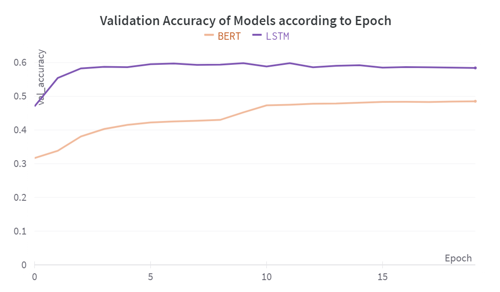
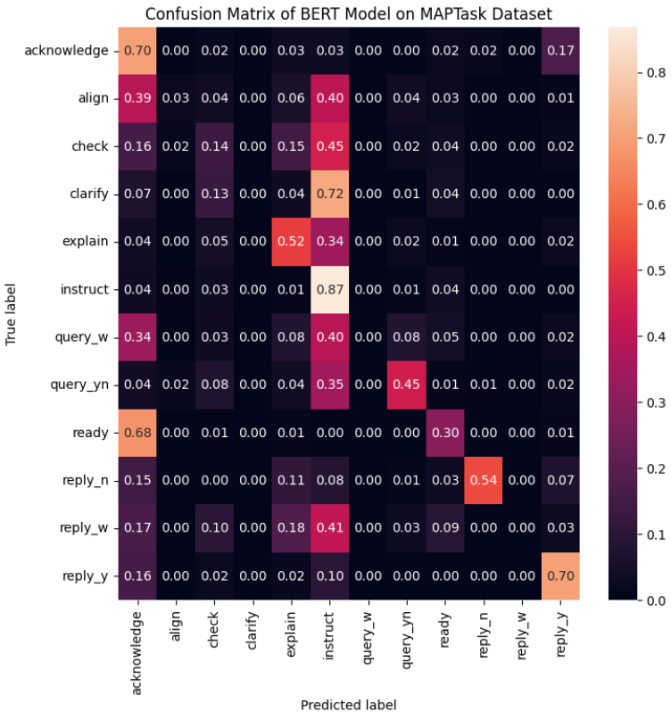

# Intent Classification

A benchmark of different approaches on the task of Intent Classification on the [Hugging Face Silicone Maptask dataset](https://huggingface.co/datasets/silicone/viewer/maptask/train):

| **Approach**          | **Model**        | **Performance (Test Accuracy)** |
| --------------------- | ---------------- | ------------------------------- |
| Human                 | Manual Labelling | 54.1%                           |
| Training from Scratch | LSTM             | 61.0%                           |
| Fine-Tuning           | BERT             | 49.7%                           |
| Prompting             | GPT-4            | *Not Yet Implemented*           |

## Dataset

The dataset has 12 labels:

| **Label**   | **Example**                                            |
| ----------- | ------------------------------------------------------ |
| acknowledge | uh-huh                                                 |
| align       | okay                                                   |
| check       | on the right-hand side roughly just                    |
| clarify     | right beside it                                        |
| explain     | i've got a gallows to the left like d-- below the left |
| instruct    | okay the start part is at the top left-hand corner     |
| query_w     | how far underneath the diamond mine                    |
| query_yn    | do you have a diamond mine there                       |
| ready       | well                                                   |
| reply_n     | no                                                     |
| reply_w     | no i haven't got that                                  |
| reply_y     | uh-huh                                                 |

The label distribution is not too imbalanced which means that accuracy is still a useful metric to use. We will also use confusion matrixes to make sure that some labels are not forgotten by our models.

<p align="center">
  
</p>

## Human Level Performance

**The human accuracy is at 54.1% (13/24 examples correct)**

Measuring this metric was done by guessing 24 labels for 24 utterances by only using for reference 3 labelled examples per label.

The logs of the expermiment are available at `human_level_perf.txt`

This sets a baseline performance and highlights challenges when predicting these labels: some labels are very similar
- "right" can be ready but can also be acknowledge or reply_y which highlights intersection between labels
- clarify ("right down there") and check ("right beside it") can be confused without punctuation

## Training from Scratch (LSTM)

In this part we train a simple LSTM model on the task:

```
Model: "sequential"
_________________________________________________________________
Layer (type)                 Output Shape              Param #   
=================================================================
embedding (Embedding)        (None, None, 128)         3906816   
_________________________________________________________________
bidirectional (Bidirectional (None, None, 512)         788480    
_________________________________________________________________
dropout (Dropout)            (None, None, 512)         0         
_________________________________________________________________
bidirectional_1 (Bidirection (None, 512)               1574912   
_________________________________________________________________
dropout_1 (Dropout)          (None, 512)               0         
_________________________________________________________________
dense (Dense)                (None, 256)               131328    
_________________________________________________________________
dropout_2 (Dropout)          (None, 256)               0         
_________________________________________________________________
dense_1 (Dense)              (None, 12)                3084      
=================================================================
Total params: 6,404,620
Trainable params: 6,404,620
Non-trainable params: 0
_________________________________________________________________
```

Training for 20 epochs results in the following accuracy plot:

<p align="center">
  
</p>

We see that even with Dropout, the model suffers from overfitting.

**The best LSTM model results in a 61.0% test accuracy**

Which beats the human baseline and has the following confusion matrix:

<p align="center">
  
</p>

As expected from the HLP experiment, the model makes most of its mistakes on labels that are very similar even for a human:
- `ready` and `acknowledge`
- `check` and `clarify`

## Fine-Tuning (BERT)

In this part, we fine-tune a BERT model on this classification task:

```
Model: "model"
__________________________________________________________________________________________________
Layer (type)                    Output Shape         Param #     Connected to                     
==================================================================================================
input_ids (InputLayer)          [(None, 124)]        0                                            
__________________________________________________________________________________________________
attention_mask (InputLayer)     [(None, 124)]        0                                            
__________________________________________________________________________________________________
tf_bert_model (TFBertModel)     TFBaseModelOutputWit 108310272   input_ids[0][0]                  
                                                                 attention_mask[0][0]             
__________________________________________________________________________________________________
global_max_pooling1d (GlobalMax (None, 768)          0           tf_bert_model[0][0]              
__________________________________________________________________________________________________
dense (Dense)                   (None, 256)          196864      global_max_pooling1d[0][0]       
__________________________________________________________________________________________________
dropout_37 (Dropout)            (None, 256)          0           dense[0][0]                      
__________________________________________________________________________________________________
dense_1 (Dense)                 (None, 12)           3084        dropout_37[0][0]                 
==================================================================================================
Total params: 108,510,220
Trainable params: 199,948
Non-trainable params: 108,310,272
__________________________________________________________________________________________________
```

Training for 20 epochs results in the following accuracy plot:

<p align="center">
  
</p>

Here we see that fine-tuning BERT is not adapted to this task as it under-performs compared to LSTM.

**The best BERT model results in a 49.7% test accuracy**

Which is slightly under the human baseline and has the following confusion matrix:

<p align="center">
  
</p>

Here we see that fine-tuning BERT struggles with the amount of different labels. The model predicts many instances as `instruct` which is fine when confused with `clarify` as they are similar classes; but is not fine when confused with `query_w` as an instruction and a question should not be similar.